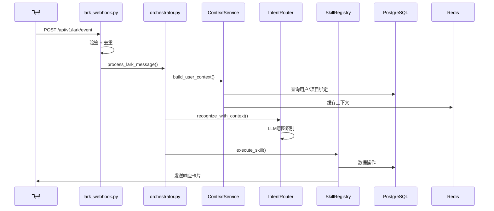
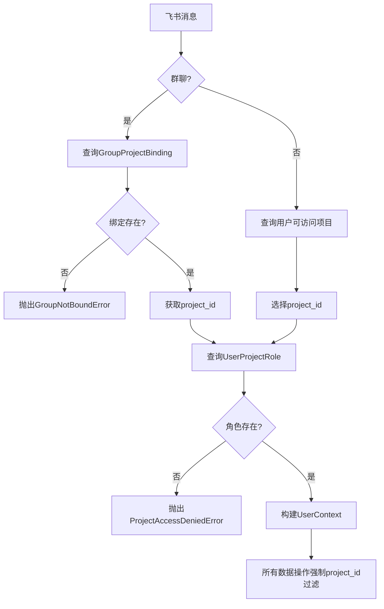

# PM数字员工系统 - 项目代码分析报告

**版本**: v1.2.0  
**生成日期**: 2026-04-19  
**分析范围**: 全量代码库

---

## 一、项目整体目录结构

### 1.1 根目录结构

```
pm-digital-employee/
├── app/                          # 应用主目录（核心代码）
├── alembic/                      # 数据库迁移
├── tests/                        # 测试代码（12个测试文件）
├── docs/                         # 文档目录
├── scripts/                      # 脚本工具（未实现）
├── docker/                       # Docker配置（Dockerfile已存在）
├── .github/                      # CI/CD配置
├── .agents/.claude/              # Claude Code配置
├── requirements.txt              # Python依赖
├── pyproject.toml                # 项目配置（极简版）
├── docker-compose.yml            # 容器编排
├── pytest.ini                    # 测试配置
├── mypy.ini                      # 类型检查配置
├── .ruff.toml                    # Lint配置
├── .env.example                  # 环境变量示例
└── 多个部署/验证文档             # 部署相关文档
```

### 1.2 app目录详细结构

```
app/
├── main.py                       # FastAPI入口
├── api/                          # API层（6个文件）
│   ├── lark_webhook.py           # 飞书Webhook入口
│   ├── lark_callback.py          # 飞书Callback处理
│   ├── health.py                 # 健康检查
│   ├── data_management.py        # 数据管理API
│   └── router.py                 # 路由汇总
├── core/                         # 核心配置（11个文件）
│   ├── config.py                 # 配置管理（pydantic-settings）
│   ├── exceptions.py             # 异常体系（完整）
│   ├── logging.py                # 日志配置（structlog）
│   ├── middleware.py             # 中间件（5种）
│   ├── dependencies.py           # 依赖注入
│   ├── unit_of_work.py           # UnitOfWork模式
│   ├── encryption.py             # 数据加密（AES-128）
│   ├── log_sanitizer.py          # 日志脱敏
│   └── rate_limiter.py           # 限流器
├── domain/                       # 领域模型
│   ├── base.py                   # 基础实体类
│   ├── enums.py                  # 业务枚举
│   └ models/                     # 数据模型（24个文件）
├── db/                           # 数据库
│   └ session.py                  # Session管理
├── repositories/                 # 数据访问层（6个）
│   ├── base.py                   # 泛型Repository基类
│   ├── project_repository.py
│   ├── task_repository.py
│   ├── risk_repository.py
│   ├── milestone_repository.py
│   └ cost_repository.py
├── services/                     # 业务服务（12个）
│   ├── context_service.py        # 上下文构建
│   ├── access_control_service.py # 权限控制
│   ├── audit_service.py          # 审计日志
│   ├── idempotency_service.py    # 幂等性
│   ├── project_service.py
│   ├── task_service.py
│   ├── risk_service.py
│   ├── milestone_service.py
│   ├── cost_service.py
├── orchestrator/                 # 编排层（8个文件）
│   ├── orchestrator.py           # 主编排器
│   ├── intent_router.py          # 意图识别
│   ├── dialog_state.py           # 对话状态机
│   ├── skill_registry.py         # Skill注册中心
│   ├── skill_manifest.py         # Skill Manifest定义
│   ├── schemas.py                # 编排相关Schema
│   └ result_formatter.py        # 结果格式化
├── skills/                       # Skill插件（10个Skill）
│   ├── base.py                   # Skill基类
│   ├── project_overview_skill.py
│   ├── weekly_report_skill.py
│   ├── policy_qa_skill.py
│   └ additional_skills.py        # 其他6个Skill
├── ai/                           # AI能力层（6个文件）
│   ├── llm_gateway.py            # LLM统一网关
│   ├── prompt_manager.py         # Prompt管理
│   ├── output_parser.py          # 输出解析
│   ├── safety_guard.py           # 安全防护
│   └ schemas.py                 # AI相关Schema
├── rag/                          # RAG检索（6个文件）
│   ├── chunker.py                # 文档分块
│   ├── indexer.py                # 向量索引
│   ├── retriever.py              # 检索器
│   ├── reranker.py               # 重排序
│   ├── qa_service.py             # QA服务
│   └ schemas.py                 # RAG Schema
├── integrations/                 # 外部集成
│   ├── lark/                     # 飞书集成（7个文件）
│   │   ├── client.py             # API客户端
│   │   ├── service.py            # 业务封装
│   │   ├── schemas.py            # 消息Schema
│   │   ├── signature.py          # 签名验证
│   │   ├── card_forms.py         # 卡片构建
│   │   ├── websocket.py          # WebSocket长连接
│   ├── base_adapter.py           # 适配器基类
├── presentation/                 # 展示层
│   ├── cards/                    # 卡片模板
│   ├── renderers.py              # 渲染器
├── security/                     # 安全模块
│   ├── input_validator.py        # 输入校验
├── events/                       # 事件系统
│   ├── bus.py                    # 事件总线
│   ├── handlers.py               # 事件处理器
├── agents/                       # Agent系统
│   ├── base.py                   # Agent基类
│   ├── planner_agent.py          # 规划Agent
├── tasks/                        # 异步任务（目录存在，文件待补充）
├── utils/                        # 工具类（目录存在）
└── tests/                        # 内部测试
```

---

## 二、各模块职责与功能定位

### 2.1 API层 (`app/api/`)

| 文件 | 职责 | 关键功能 |
|------|------|----------|
| `lark_webhook.py` | 飞书事件入口 | 接收飞书Webhook事件，验签，去重，分发 |
| `lark_callback.py` | 卡片交互处理 | 处理卡片按钮点击、表单提交 |
| `health.py` | 健康检查 | 返回服务状态、数据库/Redis连接状态 |
| `data_management.py` | 数据管理API | 项目/任务/风险等CRUD接口 |
| `router.py` | 路由汇总 | 统一注册所有API路由 |

### 2.2 核心配置层 (`app/core/`)

| 文件 | 职责 | 实现状态 |
|------|------|----------|
| `config.py` | 配置管理 | ✅ 使用pydantic-settings，支持嵌套配置 |
| `exceptions.py` | 异常体系 | ✅ 完整异常层级（ErrorCode枚举+APIException基类） |
| `logging.py` | 日志配置 | ✅ structlog，支持trace_id |
| `middleware.py` | 中间件 | ✅ 5种中间件（TraceID、日志、异常、限流、并发） |
| `dependencies.py` | 依赖注入 | ✅ Service/Repository依赖注入函数 |
| `unit_of_work.py` | 事务管理 | ✅ UnitOfWork模式实现 |
| `encryption.py` | 数据加密 | ✅ AES-128 Fernet加密 |
| `log_sanitizer.py` | 日志脱敏 | ✅ 自动脱敏敏感信息 |

### 2.3 领域模型层 (`app/domain/`)

**实体基类**:
- `Base`: SQLAlchemy DeclarativeBase
- `AuditMixin`: created_by/updated_by字段
- `TimestampMixin`: created_at/updated_at字段

**业务枚举** (`enums.py`):
- `UserRole`: PROJECT_MANAGER, PM, TECH_LEAD, MEMBER, VIEWER
- `ProjectStatus`: DRAFT, PRE_INITIATION, IN_PROGRESS, COMPLETED, CLOSED
- `TaskStatus`: TODO, IN_PROGRESS, COMPLETED, BLOCKED, CANCELLED
- `RiskLevel`: LOW, MEDIUM, HIGH, CRITICAL
- `DataSource`: lark_card, excel_import, lark_sheet_sync (v1.2.0新增)

**核心模型（24个）**:

| 模型 | 文件 | 说明 |
|------|------|------|
| Project | project.py | 项目主表，含预算、状态、时间、多源扩展字段 |
| Task | task.py | 任务表，支持WBS层级（parent_id自引用） |
| Milestone | milestone.py | 里程碑表 |
| Risk | risk.py | 风险登记册 |
| Cost | cost.py | 成本预算/实际两张表 |
| User | user.py | 用户表（飞书用户映射） |
| UserProjectRole | user_project_role.py | 用户-项目-角色关联 |
| GroupProjectBinding | group_project_binding.py | 飞书群-项目绑定（核心安全） |
| Conversation | conversation.py | 对话会话/消息历史 |
| AuditLog | audit_log.py | 审计日志 |
| Document | document.py | 项目文档 |
| SkillDefinition | skill_definition.py | Skill元数据定义 |
| Knowledge | knowledge.py | RAG知识库文档 |
| LLMUsageLog | llm_usage_log.py | LLM调用日志 |
| **v1.2.0新增** | | |
| ExcelImportLog | excel_import_log.py | Excel导入日志 |
| DataSyncLog | data_sync_log.py | 数据同步日志 |
| LarkSheetBinding | lark_sheet_binding.py | 飞书表格绑定配置 |
| DataVersion | data_version.py | 数据版本历史 |
| DataConflict | data_conflict.py | 数据冲突记录 |
| WeeklyReport | weekly_report.py | 项目周报 |
| MeetingMinutes | meeting_minutes.py | 会议纪要 |
| WBSVersion | wbs_version.py | WBS版本管理 |

### 2.4 数据访问层 (`app/repositories/`)

**泛型基类设计**:
- `BaseRepository[ModelType]`: 通用CRUD操作
- `ProjectScopedRepository[ModelType]`: 强制project_id过滤，防止跨项目访问

**关键方法**:
- `get_by_id_with_project()`: 强制项目ID验证
- `get_by_id_or_error()`: 不存在抛异常，项目不匹配抛权限异常
- `list_by_project()`: 强制项目ID过滤
- `create_in_project()`: 自动注入project_id
- `update_in_project()`: 禁止修改project_id

### 2.5 服务层 (`app/services/`)

| 服务 | 职责 |
|------|------|
| ContextService | 构建用户上下文（用户信息、项目绑定、角色、权限） |
| AccessControlService | 权限校验（项目访问、操作权限、Skill权限） |
| AuditService | 操作审计日志 |
| IdempotencyService | 幂等性检查（基于event_id） |
| ProjectService | 项目业务逻辑 |
| TaskService | 任务业务逻辑 |
| RiskService | 风险业务逻辑 |
| MilestoneService | 里程碑业务逻辑 |
| CostService | 成本业务逻辑 |

### 2.6 编排层 (`app/orchestrator/`)

**核心流程** (`orchestrator.py`):
```
1. 接收飞书消息 → process_lark_message()
2. 构建用户上下文 → _build_user_context()
3. 获取/创建对话会话 → DialogStateMachine
4. 根据状态路由:
   - IDLE → _handle_new_intent() → 意图识别 → Skill执行
   - PARAM_COLLECTING → _handle_param_collection()
   - CONFIRMATION_PENDING → _handle_confirmation()
5. 发送响应 → LarkService
```

**对话状态机**:
- `IDLE`: 等待新意图
- `PARAM_COLLECTING`: 参数收集
- `CONFIRMATION_PENDING`: 等待确认
- `EXECUTING`: 执行中
- `COMPLETED`: 完成

### 2.7 Skill插件层 (`app/skills/`)

**当前Skill（10个）**:

| Skill | 文件 | 功能 |
|------|------|------|
| project_overview | project_overview_skill.py | 项目总览查询 |
| weekly_report | weekly_report_skill.py | 项目周报生成 |
| policy_qa | policy_qa_skill.py | 制度规范答疑（RAG） |
| task_update | policy_qa_skill.py | 任务进度更新 |
| risk_alert | policy_qa_skill.py | 风险识别预警 |
| cost_monitor | policy_qa_skill.py | 成本监控 |
| wbs_generation | additional_skills.py | WBS自动生成 |
| project_query | additional_skills.py | 项目情况咨询 |
| meeting_minutes | additional_skills.py | 会议纪要生成 |
| compliance_review | additional_skills.py | 预立项材料合规初审 |

**Skill基类** (`base.py`):
- 必须定义: `skill_name`, `display_name`, `description`, `version`
- 实现: `async execute() -> SkillExecutionResult`
- 提供: `build_success_result()`, `build_error_result()`

### 2.8 AI能力层 (`app/ai/`)

| 组件 | 职责 |
|------|------|
| LLMGateway | 统一LLM调用接口，支持多提供商、重试、降级 |
| PromptManager | Prompt模板管理 |
| OutputParser | 结构化输出解析 |
| SafetyGuard | 输出安全检查（敏感词、合规） |

**LLM提供商支持**:
- OpenAI（兼容Finna API）
- Azure OpenAI
- 智谱（GLM-4）
- 通义千问（Qwen-Max）

### 2.9 RAG层 (`app/rag/`)

| 组件 | 职责 |
|------|------|
| Chunker | 文档分块（支持Markdown、PDF、Word） |
| Indexer | 向量索引（pgvector） |
| Retriever | 检索器（相似度+部门权限过滤） |
| Reranker | 重排序 |
| QAService | QA问答服务 |

---

## 三、技术栈完整清单

### 3.1 核心技术栈

| 类别 | 技术 | 版本要求 |
|------|------|----------|
| 语言 | Python | 3.11+ |
| Web框架 | FastAPI | 0.115.0 |
| ORM | SQLAlchemy | 2.0+（异步） |
| 数据校验 | Pydantic | v2 |
| 数据库 | PostgreSQL | 15+（含pgvector） |
| 缓存 | Redis | 7+ |
| 异步任务 | Celery + RabbitMQ | 5.4+ |
| 飞书SDK | lark-oapi | 1.0+ |
| LLM | OpenAI SDK | 1.57+ |

### 3.2 开发工具

| 工具 | 用途 |
|------|------|
| pytest + pytest-asyncio | 测试框架 |
| ruff | Lint检查 |
| black | 代码格式化 |
| mypy | 类型检查 |
| Alembic | 数据库迁移 |
| Docker Compose | 容器编排 |

### 3.3 中间件栈

| 中间件 | 实现 |
|------|------|
| TraceIDMiddleware | 生成/传递trace_id |
| RequestLoggingMiddleware | 请求日志 |
| ExceptionHandlerMiddleware | 全局异常处理 |
| RateLimitMiddleware | 限流（slowapi） |
| ConcurrentLimitMiddleware | 并发控制 |

---

## 四、核心业务逻辑与数据流

### 4.1 消息处理主流程



### 4.2 项目隔离安全流程



### 4.3 Skill执行流程

```
1. IntentRouter识别意图 → 返回IntentResult（skill_name, params）
2. SkillRegistry获取Skill类
3. 创建Skill实例（传入Manifest、Context、Session）
4. 调用execute()
5. 返回SkillExecutionResult
6. ResultFormatter格式化
7. LarkService发送响应
```

---

## 五、现有代码优点

### 5.1 架构优点

| 优点 | 说明 |
|------|------|
| ✅ 9层分层架构清晰 | 职责分明，便于维护 |
| ✅ 项目隔离机制完善 | ProjectScopedRepository强制过滤，防止跨项目访问 |
| ✅ 异常体系完整 | ErrorCode枚举 + 继承体系 + HTTP状态码映射 |
| ✅ 依赖注入支持 | dependencies.py提供Service/Repository注入函数 |
| ✅ UnitOfWork模式 | 事务边界管理，支持rollback |
| ✅ 多源数据录入设计 | v1.2.0新增5个核心模型，支持Excel/飞书表格/卡片三种录入 |
| ✅ 中间件栈完善 | 5种中间件覆盖trace_id、日志、异常、限流、并发 |

### 5.2 代码质量优点

| 优点 | 说明 |
|------|------|
| ✅ 类型注解完整 | 所有函数有Type Hints |
| ✅ Docstring规范 | 中英文混合，关键逻辑有注释 |
| ✅ 测试覆盖 | 12个测试文件，覆盖签名、卡片、Repository、加密等 |
| ✅ 配置管理规范 | pydantic-settings，支持.env和环境变量 |
| ✅ 日志脱敏 | LogSanitizer自动脱敏手机号、邮箱等 |

---

## 六、现有代码问题与风险点

### 6.1 目录结构问题

| 问题 | 位置 | 严重程度 |
|------|------|----------|
| ❌ scripts目录空 | scripts/ | 中 |
| ❌ utils目录空 | app/utils/ | 中 |
| ❌ tasks目录空 | app/tasks/ | 高（Celery未实现） |
| ❌ 多个Skill合并到单文件 | policy_qa_skill.py含4个Skill | 中 |
| ❌ docker/目录无Dockerfile.worker | docker/ | 中 |
| ❌ .pre-commit-config.yaml缺失 | 根目录 | 中 |

### 6.2 架构设计问题

| 问题 | 说明 | 参考 |
|------|------|------|
| ⚠️ 全局单例未重构 | 多个服务使用全局变量实例 | CHANGELOG.md记录待重构 |
| ⚠️ Skill按PMBOK分类缺失 | 当前扁平化，未按十大领域分目录 | 参考提示词Part 1 |
| ⚠️ LarkBitableService未实现 | 飞书多维表格双向同步缺失 | 参考提示词Part 2 |
| ⚠️ PermissionService权限矩阵未实现 | 参考提示词中的PERMISSION_MATRIX | 参考提示词Part 2.3 |
| ⚠️ ProjectIsolationService未独立 | 项目隔离逻辑分散在多处 | 参考提示词Part 2.3 |
| ⚠️ CardBuilder流式API未实现 | 当前card_forms.py较简单 | 参考提示词Part 2.1 |

### 6.3 代码实现问题

| 问题 | 文件 | 说明 |
|------|------|------|
| ⚠️ BaseSkill.get_manifest重复定义 | base.py:95-114 | 两处相同方法 |
| ⚠️ LLMGateway缺少generate_with_fallback | llm_gateway.py | 参考提示词要求降级策略 |
| ⚠️ EventHandler未实现装饰器模式 | 参考提示词要求@on_event装饰器 | 参考提示词Part 2.1 |
| ⚠️ ConversationSession未完整实现 | conversation.py | 多轮对话上下文管理 |

### 6.4 测试覆盖问题

| 问题 | 说明 |
|------|------|
| ⚠️ 测试覆盖率未达80% | 当前12个测试文件，核心Skill未覆盖 |
| ⚠️ E2E测试缺失 | 无飞书集成端到端测试 |
| ⚠️ conftest.py全局Mock可能过度 | autouse=True影响所有测试 |

### 6.5 文档问题

| 问题 | 说明 |
|------|------|
| ⚠️ 根目录文档过多 | 多个部署验证文档散落根目录 |
| ⚠️ docs/api/目录缺失 | API文档未结构化 |
| ⚠️ docs/architecture/目录缺失 | 架构文档未结构化 |

---

## 七、总结

### 代码成熟度评估

| 维度 | 评分 | 说明 |
|------|------|------|
| 目录结构 | 7/10 | 基本完整，部分目录空，Skill未分类 |
| 核心架构 | 8/10 | 9层分层清晰，项目隔离完善 |
| 代码质量 | 7/10 | 类型注解完整，部分重复代码 |
| 测试覆盖 | 5/10 | 12个测试文件，覆盖率不足 |
| 文档规范 | 6/10 | CLAUDE.md完善，其他文档散乱 |
| 安全合规 | 8/10 | 加密、脱敏、权限校验已实现 |

### 关键待完成项

1. **tasks目录开发**: Celery异步任务实现
2. **LarkBitableService**: 飞书多维表格双向同步
3. **Skill分类重构**: 按PMBOK十大领域分目录
4. **测试覆盖率提升**: 至80%
5. **全局单例重构**: 改为依赖注入模式